# IGS 剧场 · DSH Tavern 版（dsh-tavern-igs）

把 [DSH Tavern](https://github.com/flizzywine/dsh-tavern) 的聊天变成一部会自己排版、配图、配乐的视觉小说。

**正文先出，演出后到。** Tavern 照常流式输出正文，你可以立刻读；这一轮写完后，插件在后台让一个「导演」模型把正文整理成场景脚本：谁在说话、什么表情、站在哪、镜头怎么走、要不要插一张 CG、给你几个选项。整理好之前剧场就能按原文先演，整理好后画面会原地更新。


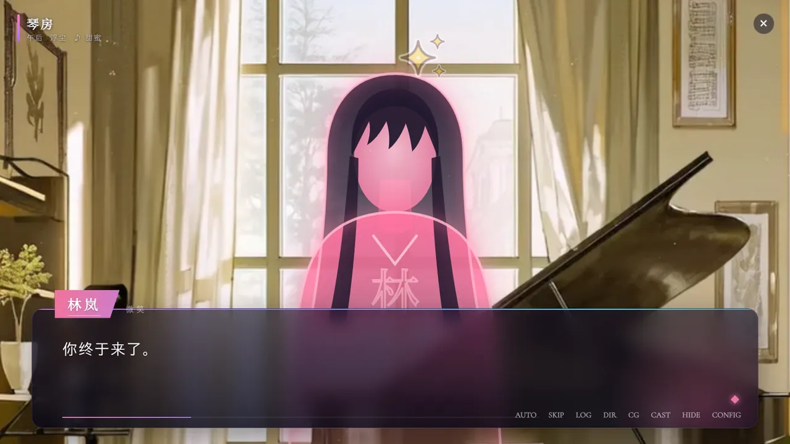

| | |
|---|---|
| 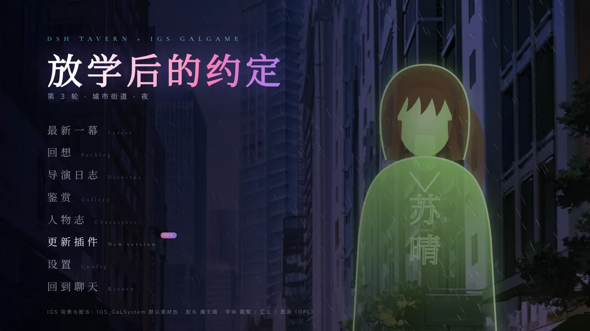 | 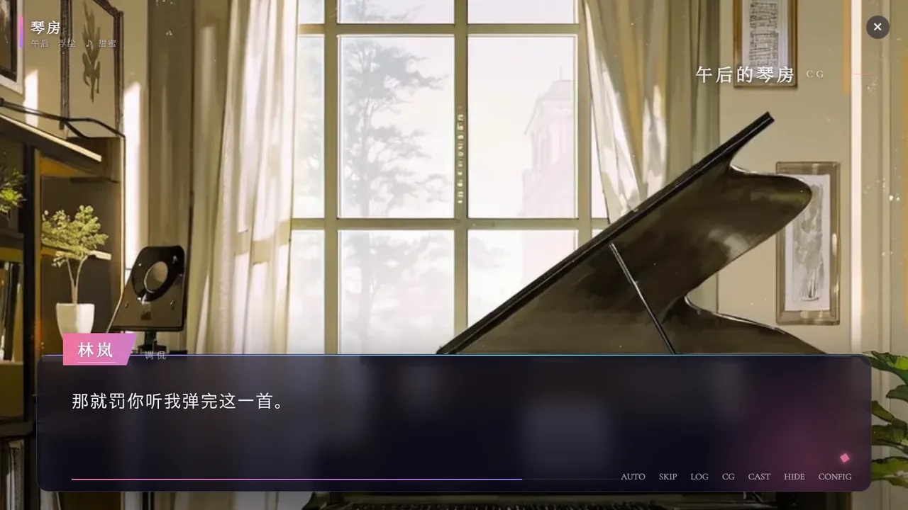 |
| 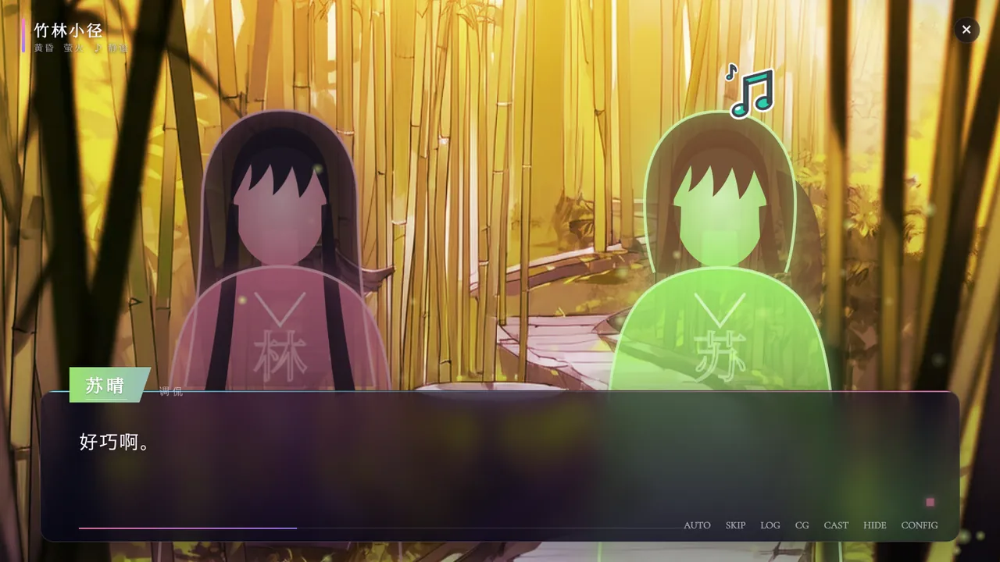 | 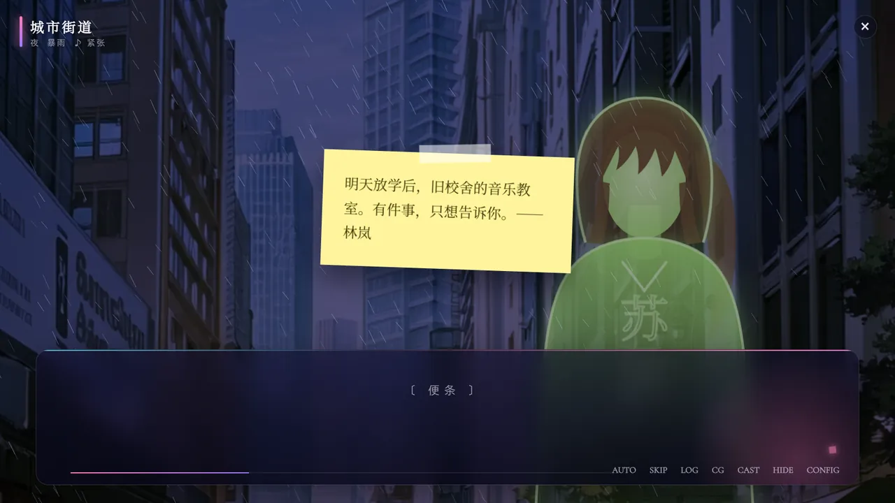 |
| 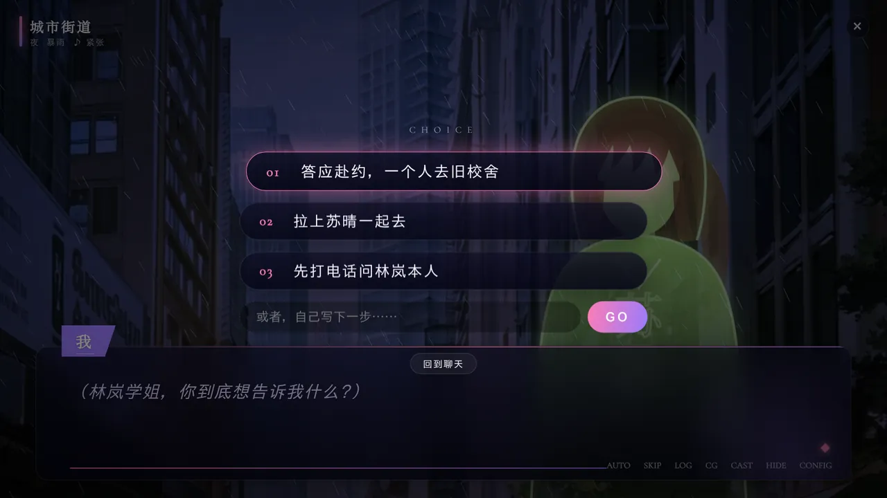 | 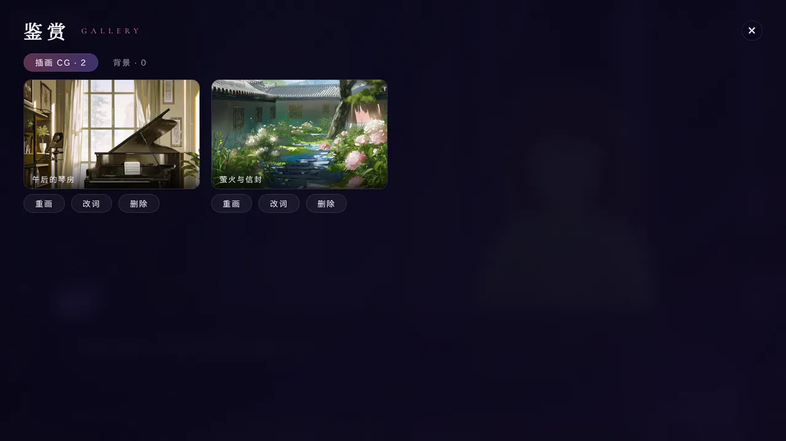 |
| 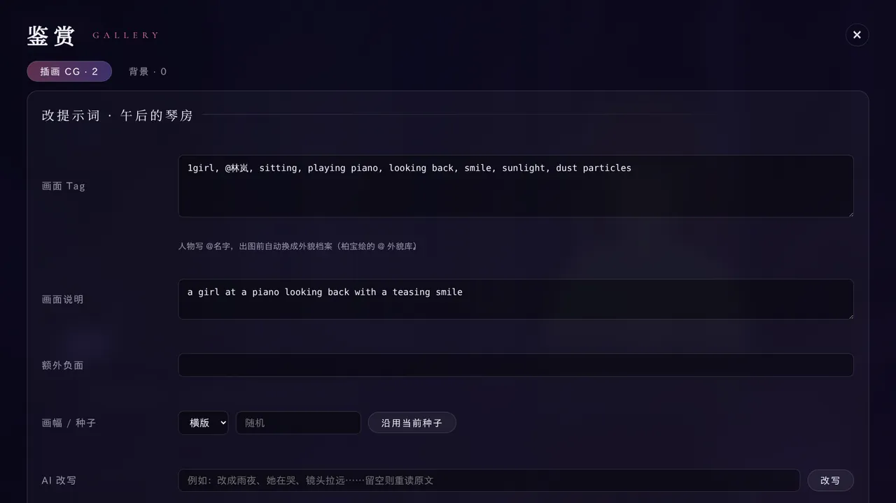 | 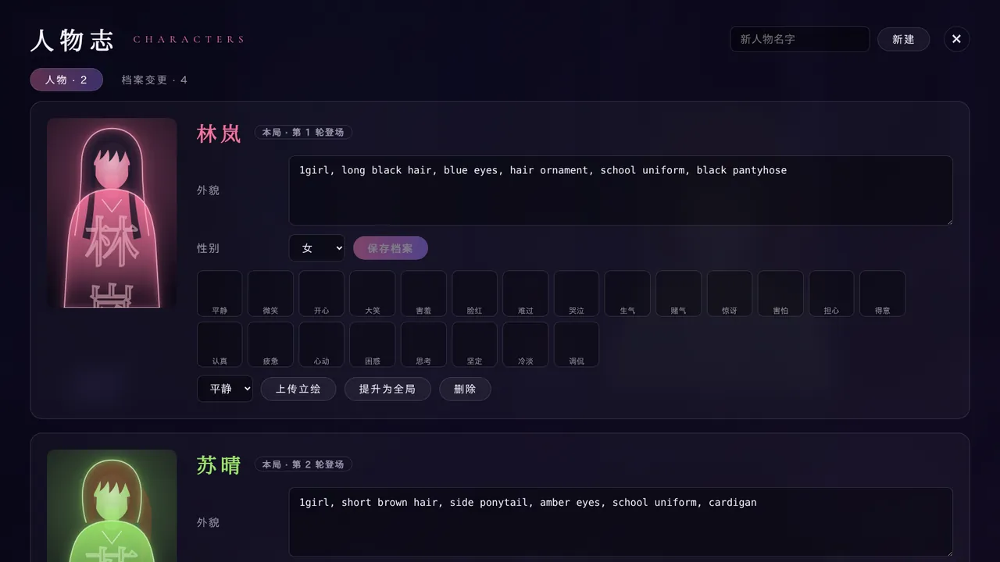 |
| 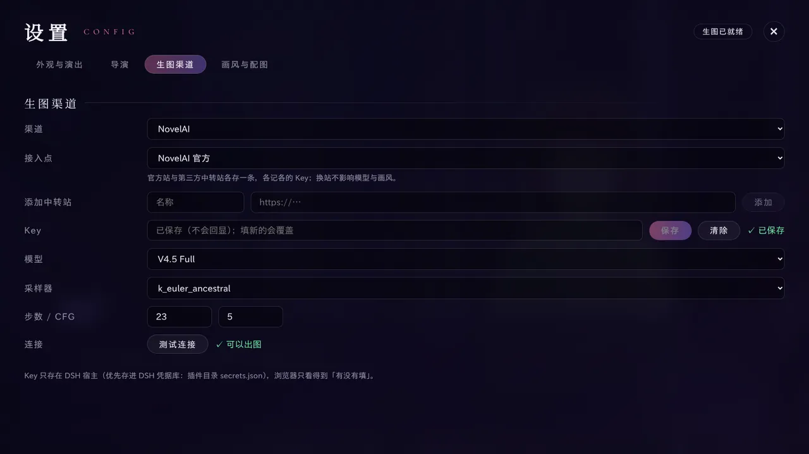 | 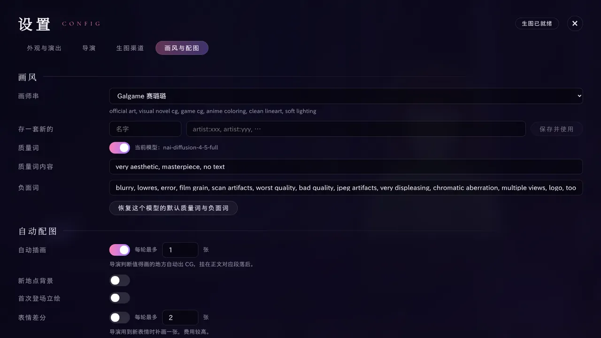 |
| 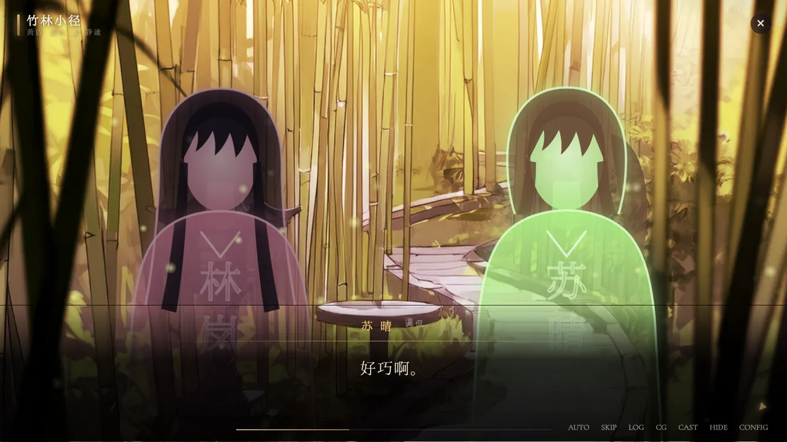 | 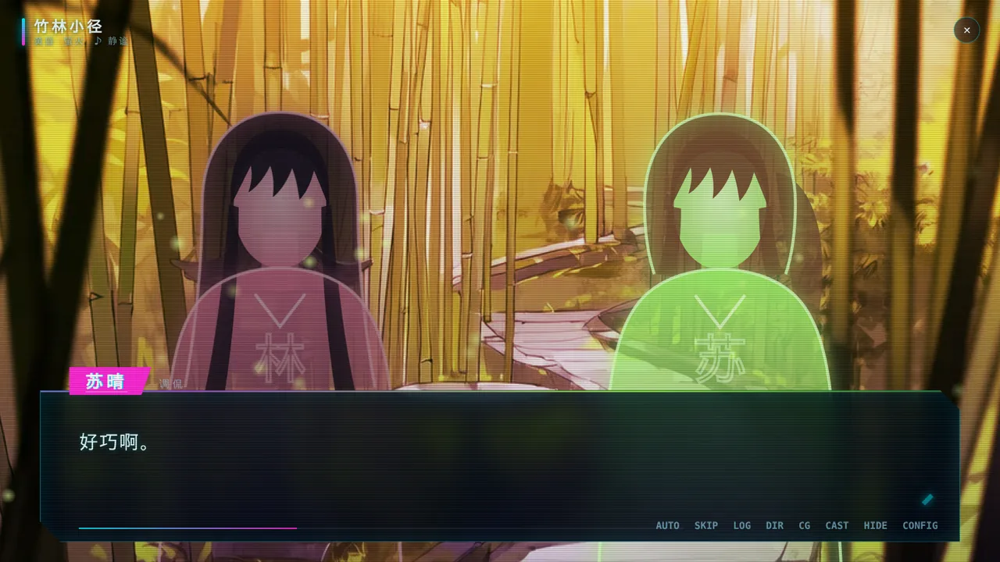 |
| 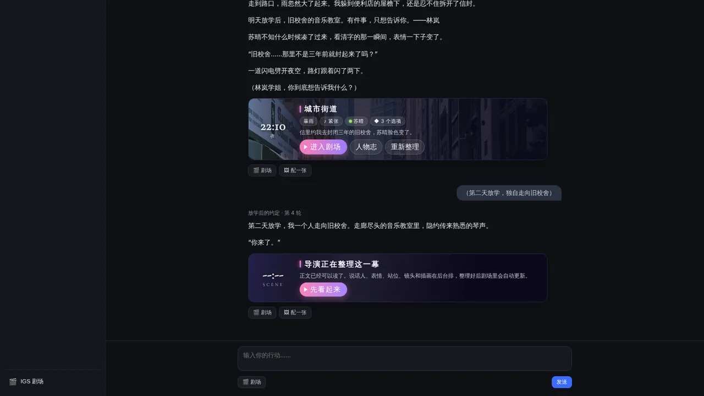 | 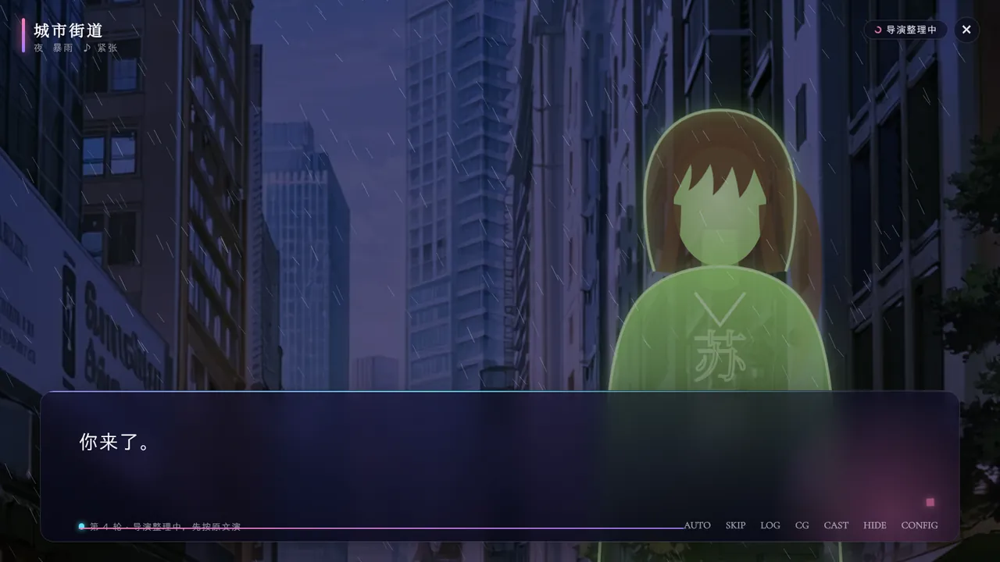 |

<p align="center">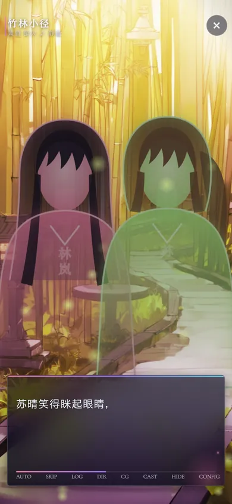</p>

> 截图来自本目录的预览环境：没有生图 Key，所以 CG 用 IGS 背景库的图临时代替，人物用按外貌档案画的剪影代替立绘。接上 NovelAI / ComfyUI 等渠道后，这些位置是真正生成的 CG 和立绘。

## 安装

需要 DSH Tavern（插件接口 v1，`dsh >=0.1.0-rc.8`）。

```sh
git clone https://github.com/Anyno001/IGS_GaLSystem.git
pnpm dsh plugin --profile web add ./IGS_GaLSystem/dsh-tavern
```

仓库里已经带了构建好的 `client.js`，不需要自己打包。改了 `src/client/` 之后再重建：

```sh
cd dsh-tavern
npm install
npm run build     # 生成 client.js（会从 ../app/src 复用 IGS 的漫画符号样式）
npm test
```

装好后，Tavern 侧栏底部会多一个「🎬 IGS 剧场」按钮；设置 → 插件里有一张简版设置卡，完整设置在剧场里的 CONFIG。

## 在聊天里

- **场景卡**：每轮正文下方一张卡，显示地点、时段、天气、配乐情绪、在场人物和选项数，按钮是「进入剧场 / 人物志 / 重新整理」。导演还没整理完时显示「导演正在整理这一幕」和「先看起来」。
- **插画卡**：导演决定这一轮值得一张 CG 时，CG 直接插在对应段落下面。悬停出现工具条：切换历史版本、重画、改词，点图放大。
- **消息按钮**：每条回复上有「🎬 剧场」（从这一轮开始看）和「🖼 配一张」（让导演为这一轮补一张 CG）。
- 想让剧场在每轮写完后自动弹出，打开设置里的「新一轮写完后自动打开剧场」。

## 剧场

- **舞台**：背景按「AI 生成的地点背景 → IGS 背景库（72 张）→ 程序绘制的天空与天际线」依次取，时段和天气会给画面调色；转场有溶解、电影黑边、横扫、圆形收缩、百叶、黑场、白闪几种。
- **人物**：说话的人亮起、其余人退后；旁白描写某人的动作时也会让那人换表情。没有立绘的人物画成剪影，发型、发色、马尾双马尾都按外貌档案来。
- **演出**：IGS 的漫画符号（汗滴、怒筋、爱心、音符……）、镜头推近 / 拉远 / 平移 / 倾斜 / 震动 / 闪白 / 红闪、短信 / 信件 / 便条 / 报纸 / 终端 / 告示 / 日记 / 卷轴八种情境卡片、十一种天气粒子（雨、暴雨、雪、樱花、落叶、萤火、余烬、浮尘、光斑、星空、雾）。
- **声音**：IGS 的 80 首魔王魂配乐按场景情绪和地点自动选曲、交叉淡入；角色说话有打字音，按名字区分音高。
- **阅读**：逐字显示、自动、快进、回想（滚轮或 L）、隐藏界面（H）、每局记住读到哪里。键盘：空格 / 回车 / → 翻页，← 后退，A 自动，Ctrl 快进，Esc 回到聊天。
- **选项**：一轮的最后给出导演写的选项和自由输入框。选好后文字会填进 Tavern 的输入框（同时复制到剪贴板），剧场收起，下一轮写完会自动回来接着演。
- **皮肤**：星穹（默认）、樱色、水墨、夜金、赛博五套，字体从 IGS 的字体包按需加载。手机竖屏自动换布局。

## 柏宝绘的那一套

生图部分按 ST-BaiBai-Image（柏宝绘）的思路重新实现：

- **角色外貌库**：有名字的角色第一次出场自动建档。导演写分镜时只写 `@林岚`，出图前机械替换成档案里的外貌 tag，所以同一个人每张图长得一样。
- **外貌时间线**：剪了头发、换了制服这种永久变化，从发生那一轮开始生效，之前的轮次重画时仍用旧外貌。湿身、包扎这类临时状态单独记，解除时清掉，不污染档案。
- **改动日志与回滚**：AI 对档案的每次改动都记在「档案变更」里，可以一键回滚。
- **全局角色**：把一个人「提升为全局」后，所有存档共用这份档案，AI 不再改它；也可以复制回本局再改。
- **画师串与质量词**：内置几套画师串，也能存自己的；质量词、负面词按模型分别设置。
- **CG 队列与版本**：出图排队、可取消，重画保留历史版本，随时切回旧版本。
- **改词**：在鉴赏里打开任意一张图，可以直接改 tag、描述、负面词、横竖构图和种子，或者让 AI 按你的一句话改写提示词，再看最终发给模型的完整提示词。
- **立绘与表情**：角色首次登场自动生成立绘；可选按表情生成差分（会多花钱，默认关）；人物志里能逐个表情生成或上传自己的图。
- **生图渠道**：
  - NovelAI：官方接口，也可以加多个中转地址来回切换；模型、采样器、步数、CFG 可调。
  - ComfyUI：简单模式填 checkpoint 即可；高级模式导入 API 格式的工作流 JSON，用 `%prompt%`、`%negative%`、`%width%`、`%seed%` 这类占位符接参数。
  - OpenAI 兼容的图片接口（gpt-image-1 等）。
  - Stable Diffusion WebUI（A1111 / Forge）。

  每个渠道都有「测试连接」。

## 隐私与密钥

- API Key 只存在宿主这一侧：优先放进 DSH 的凭据服务，没有凭据服务时存在插件数据目录下权限为 0600 的 `secrets.json`。浏览器只能看到「已填写」，拿不到 Key 本身。
- 插件只写 `$DSH_HOME/dsh-tavern-igs/`（设置、每局的场景脚本与人物档案、生成的图片），不读写 Tavern 自己的数据目录，也不给 Tavern 打补丁，只用公开的插件接口。
- IGS 的背景、配乐和字体默认从 jsDelivr 上的 IGS 发布仓库读取，不随插件打包。离线使用时可以在设置里把「素材地址」指向自己托管的 `app/dist/`，或者关掉 IGS 背景库和配乐。

## 预览与截图

不装 DSH 也能看效果：

```sh
npm run preview        # http://localhost:5178/ ，假的 Tavern 页面 + 假的模型和生图后端
npm run screenshots    # 需要 playwright；截图输出到 .tmp-screenshots/
```

预览服务用真实的插件引擎，只把 Tavern、对话模型和生图接口换成了本地假实现，故事在 `scripts/preview/story.mjs`。

## 实现说明

- 宿主半边：`lib/`。`segment.js` 把正文切成旁白 / 台词 / 心声单元；`director.js` 和 `prompts.js` 负责导演提示词和结果校验；`engine.js` 管排队、出图、挂载到正文；`cast.js` 是外貌库；`image/` 是四个生图渠道。
- 浏览器半边：`src/client/`，打包成 `client.js`。React 由 DSH 提供，不打进包里。
- 本插件与 [IGS_GaLSystem](https://github.com/Anyno001/IGS_GaLSystem) 同仓库：漫画符号 SVG 与样式、背景库、配乐目录直接复用 IGS 的代码和素材。
- 功能参考了 [bigmalove/galgame](https://github.com/bigmalove/galgame) 和柏宝绘（ST-BaiBai-Image），代码全部重新编写，没有复制这两个项目和 DSH Tavern 本身的代码或样式。

## 鸣谢

- 配乐：魔王魂（https://maou.audio/ ，作曲：森田交一），曲目清单见 `app/dist/bgm/CREDITS.md`。
- 字体：霞鹜文楷、霞鹜新晰黑、霞鹜新致宋、思源宋体、汇文明朝体等，随 IGS 发布，授权见 `app/dist/fonts/`。
- 背景图与漫画符号：IGS 素材包。
